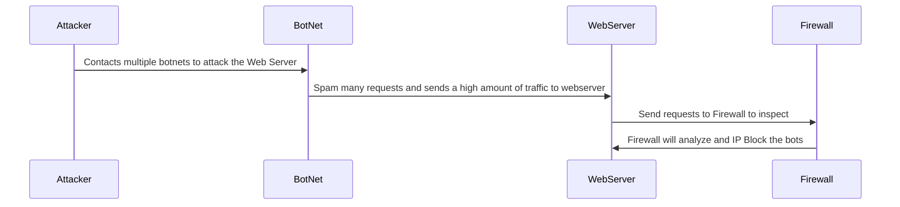

## DDoS Attack Sequence Diagram

```mermaid
sequenceDiagram
    participant Attacker
    participant BotNet
    participant WebServer
    participant Firewall

    Attacker ->> BotNet: Contacts multiple botnets to attack the Web Server
    BotNet->>WebServer: Spam many requests and sends a high amount of traffic to webserver
    WebServer->>Firewall: Send requests to Firewall to inspect
    Firewall->>WebServer: Firewall will analyze and IP Block the bots


```
