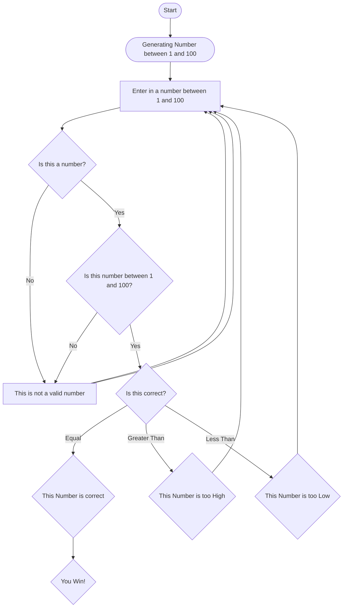

# Guessing Game Flowchart

## Flowchart

```mermaid
flowchart TD
    Start([Start]) --> GenerateNumber([Generating Number between 1 and 100])
    GenerateNumber --> NumberVal[Enter in a number between 1 and 100]
    NumberVal --> IsNum{Is this a number?}
    
    IsNum -- "No" --> NotInRange["This is not a number"] --> NumberVal
    IsNum -- "Yes" --> InRange{Is this number between 1 and 100?}
    InRange -- "No" --> NotInRange["This is not a valid number"] --> NumberVal
    InRange -- "Yes" --> NumCheck{Is this correct?}
    NumCheck -- "Equal" --> Correct{This Number is correct}
    Correct --> YouWin{You Win!}
    NumCheck -- "Greater Than" --> ResultHigh{This Number is too High}
    ResultHigh --> NumberVal
    NumCheck -- "Less Than" --> ResultLow{This Number is too Low}
    ResultLow --> NumberVal
```
